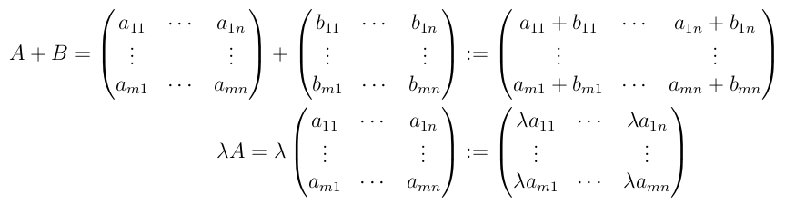

# 7

> Seien $A$ und $B$ zwei reelle $m \times n$-Matrizen und sei $\lambda \in \mathbb{R}$.
> 
> Bestimmen Sie, ob die Menge aller reellen $m \times n$-Matrizen mit diesen Operationen einen Vektorraum bildet.

* V1: Abgeschlossenheit bzgl. $\oplus$ ist gegeben, da die Addition in $\mathbb{R}$ wieder einen Wert aus $\mathbb{R}$ zum Ergbenis hat und so mit auch die Vektoraddition zweier reeller $m \times n$-Matrizen wieder eine reelle $m \times n$-Matrix ergibt.
* V2: Assoziativität bzgl. $\oplus$ ist gegeben, da die Addition feldweise in $\mathbb{R}$ durchgeführt wird und  Addition in $\mathbb{R}$ assoziativ ist.
* V3: neutrales Element bzgl. $\oplus$ ist eine $m \times n$-Matrix, die in jedem Feld den Wert $0$ hat, da $0$ neutrales Element bzgl. $+$ in $\mathbb{R}$
* V4: inverses Element bzgl. $\oplus$ ist eine reelle $m \times n$-Matrix, die in jedem Wert den negativen Wert $-a_{ij}$ der Ursprungsmatrix in diesem Feld hat.
* V5: Kommutativität bzgl. $\oplus$ ist gegeben, da die Vektoraddition als feldweise Addition in $\mathbb{R}$ durchgeführt wird und  Addition in $\mathbb{R}$ kommutativ ist.
* V6: Abgeschlossenheit bzgl. $\odot$ ist gegeben, da das Ergebnis der Multiplikation eines Skalars mit einer reellen $m \times n$-Matrix wieder eine reelle $m \times n$-Matrix ist: Jedes Feld wird in $\mathbb{R}$ mit dem Skalar multipliziert.
* V7: Distributivitätsgesetz gilt, weil Skalarmultiplikation und Vektoraddition im Endeffekt feldweise in $\mathbb{R}$ durchgeführt werden und in dort das Distributivgesetz gilt.
* V8: Dasselbe gilt für das Distributivitätsgesetz bei Skalaraddition und Skalarmultiplikation, da auch die Skalaraddition in $\mathbb{R}$ geschieht.
* V9: Ebenso gilt das für das Assoziativitätsgesetz bzgl. Skalarmultiplikation und Multiplikation zweier Skalare, da auch das im Endeffekt in $\mathbb{R}$ durchgeführt wird und dort das Assoziativitätsgesetz bzgl. $\cdot$ gilt
* V10: Das Ergebnis der Multiplikation einer Matrix mit dem Skalar $1$ ist wieder die Matrix selbst, da die Multiplikation feldweise in $\mathbb{R}$ durchgeführt wird und $1$ in $\mathbb{R}$ das neutrale Element bzgl. Multiplikation ist. Somit erhält jedes Feld denselben Wert wie in der Ursprungsmatrix.

Alle 10 Vektorraum-Axiome sind erfüllt. Also bildet die Menge der reellen $m \times n$-Matrizen mit den genannten Operationen einen Vektorraum.