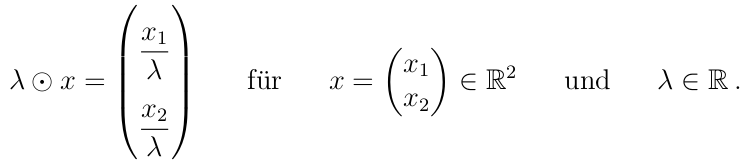

# 8

> Überprüfen Sie, ob der $\mathbb{R}^2$ mit der gewöhnlichen Vektoraddition und folgender Skalarmultiplikation alle Vektorraumaxiome erfüllt:
> 

## V6: Abgeschlossenheit bzgl. $\odot$

zu zeigen: $\forall x \in \mathbb{R}^2, \forall \lambda \in \mathbb{R} : (\lambda \odot x) \in \mathbb{R}^2$

Gegenbeispiel:

$0 \odot x = \left(\begin{array}{c}\frac{x_1}{0}\\\frac{x_2}{0}\end{array}\right) \notin \mathbb{R}^2$, da die Division durch Null nicht definiert ist.

$\Rightarrow$ V6 ist nicht erfüllt.

Mit der so definierten Skalarmultiplikation ist $\mathbb{R}^2$ kein Vektorraum.
