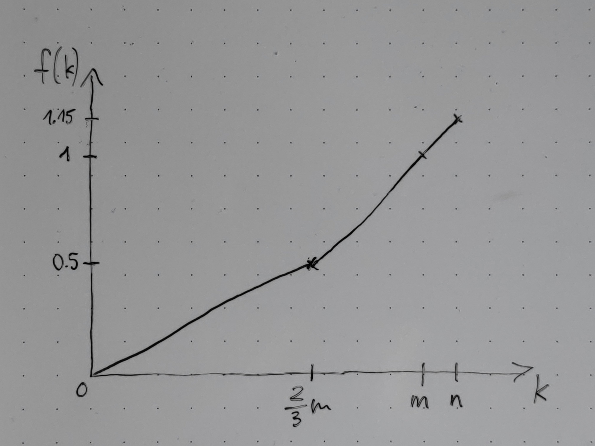

# 3

> Lesen Sie die Proseminar-Richtlinien. Als Ergänzung werde für $k < \frac 23 m$ (also für eine Anzahl von Kreuzen, die unter der Mindestanforderung für eine positive Gesamtnote liegt) die Teilbewertung für die Kreuze nach der Formel $\frac{3k}{4m}$ berechnet. Zeichnen Sie den Funktionsgraph der Teilbewertung für die Kreuze für $k$ von $0$ bis $n$ für unbestimmtes $n$ und geben Sie die vorkommenden Steigungen an.

$f(k) =$

* $\frac{3k}{4m} = \frac{33k}{40n}$ für $k < \frac 23 m$
* $\frac {3k}{2m} - \frac 12 = \frac{33k}{20n} - \frac 12$ für $k \geq \frac 23 m$

Steigung:

* für $k < \frac 23 m$: $\frac{3}{4m} = \frac{33}{40n}$
* für $k \geq \frac 23 m$: $\frac {3}{2m} = \frac{33}{20n}$

Plot in Wolfram Alpha:

`Plot[Piecewise[{{3/4x, x < 2/3}, {3/2x-1/2, x >= 2/3}}]]`

> Berechnen Sie weiters für folgende Annahmen und Einzelleistungen die Proseminar-Gesamtbewertung $g$ und die Note:
> 
> * Kreuze: $n = 55$ ankreuzbare Aufgaben, $k = 40$ Aufgaben angekreuzt
> * Tafelleistungen:
> $$\frac{\frac 56 + \frac 46}{2}$$
> 
> * Tests: 16 Punkte pro Test erreichbar, erreichte Punkte bei den vier Tests: 11, 9, 6, 8

* Kreuze:

$$m = \frac{10}{11} n = 50$$

$$\frac{3k}{2m} - \frac 12 = \frac{120 - 50}{100} = 0.7$$

* Tafelleistungen:

$$\frac{\frac 56 + \frac 46}{2} = \frac{9}{6 \times 2} = \frac 34 = 0.75$$

* Tests:

$$\frac{11 + 9 + 8}{16 \times 3} = \frac{28}{48} = \frac{7}{12} = 0.58\overline{3}$$

* Gesamtbewertung:

$$\frac{0.7 + 0.75 + 0.58\overline{3}}{3} = \frac{2.0\overline{3}}{3} = 0.6\overline{7}$$

* Note: $3$