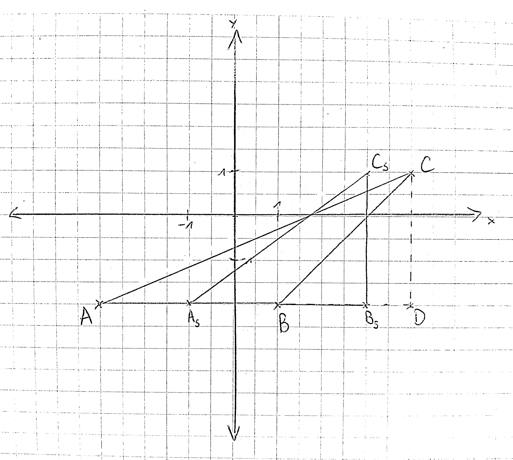

# 17

## Berechnung des Flächeninhalts

Sei $ACD$ ein rechtwinkliges Dreieck mit den Eckpunkten $A$ und $C$, das die Fläche des Dreiecks $ABC$ beinhaltet. Dann hat der neue Eckpunkt $D$ die Koordinaten $\left(\begin{array}{r}4\\-2\end{array}\right)$.

Die Fläche des Dreiecks $ABC$ lässt sich dann so berechnen:

$A_{ABC} = A_{ACD} - A_{BCD}$

Da die Dreieicke $ACD$ und $BCD$ beide rechtwinklig sind, gilt:

$A_{ACD} - A_{BCD} = \frac{\Delta_{AD} \cdot \Delta_{CD}}{2} - \frac{\Delta_{BD} \cdot \Delta_{CD}}{2}$

$= \frac{|(-3) - 4| \cdot |1 - (-2)| - |1-4| \cdot |1-(-2)|}{2} = \frac{7 \cdot 3 - 3 \cdot 3}{2} = \frac{21-9}{2} = \frac{12}{2} = 6$

## Anwendung der Scherung

$A_S = f_S(A) = S \cdot A = \left(\begin{array}{rr}1 & -1\\0 & 1\end{array}\right) \cdot \left(\begin{array}{r}-3\\-2\end{array}\right) = \left(\begin{array}{r}1 \cdot (-3) + (-1) \cdot (-2)\\0 \cdot (-3) + 1 \cdot (-2)\end{array}\right) = \left(\begin{array}{r}-3 + 2\\0 -2\end{array}\right) = \left(\begin{array}{r}-1\\-2\end{array}\right)$

$B_S = f_S(B) = S \cdot B = \left(\begin{array}{rr}1 & -1\\0 & 1\end{array}\right) \cdot \left(\begin{array}{r}1\\-2\end{array}\right) = \left(\begin{array}{r}1 \cdot 1 + (-1) \cdot (-2)\\0 \cdot 1 + 1 \cdot (-2)\end{array}\right) = \left(\begin{array}{r}1+2\\0-2\end{array}\right) = \left(\begin{array}{r}3\\-2\end{array}\right)$

$C_S = f_S(C) = S \cdot C = \left(\begin{array}{rr}1 & -1\\0 & 1\end{array}\right) \cdot \left(\begin{array}{r}4\\1\end{array}\right) = \left(\begin{array}{r}1 \cdot 4 + (-1) \cdot 1 \\ 0 \cdot 4 + 1 \cdot 1\end{array}\right) = \left(\begin{array}{r}4-1\\0+1\end{array}\right) = \left(\begin{array}{r}3\\1\end{array}\right)$

## Berechnung des Flächeninhalts des neuen Dreiecks

$A_{A_S B_S C_S} = \frac{\Delta_{A_S B_S} \cdot \Delta_{B_S C_S}}{2} = \frac{|(-1)-3| \cdot |(-2)-1|}{2} = \frac{4 \cdot 3}{2} = 6$

## direkte Abbildung ohne Matrix-Vektor-Produkt

Sei ein Vektor in $\mathbb{R}^2$ definiert als $\left(\begin{array}{r}x\\y\end{array}\right)$ mit $x,y \in \mathbb{R}$ beliebig aber fix.

Dann gilt:

$f_S(\left(\begin{array}{r}x\\y\end{array}\right)) = S \cdot \left(\begin{array}{r}x\\y\end{array}\right) = \left(\begin{array}{rr}1 & -1\\0 & 1\end{array}\right) \cdot \left(\begin{array}{r}x\\y\end{array}\right) = \left(\begin{array}{r}1 \cdot x + (-1) \cdot y\\0 \cdot x + 1 \cdot y\end{array}\right) = \left(\begin{array}{r}x-y\\y\end{array}\right)$