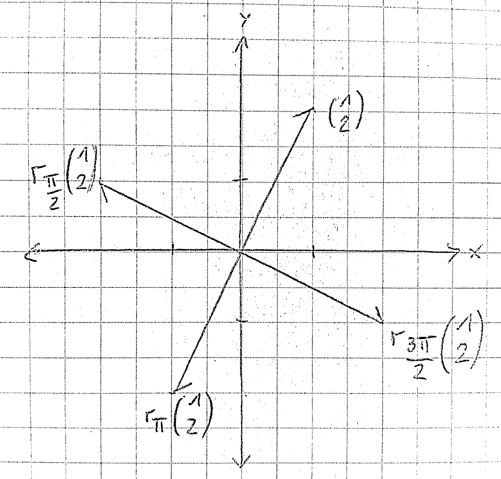

# 19

## zu zeigen: $r_\phi$ ist eine lineare Abbildung

1. zu zeigen: $\forall u,v \in \mathbb{R}^2 : r_\phi(u+v) = r_\phi(u) + r_\phi(v)$

Seien $u = \left(\begin{array}{r}u_1 \\ u_2\end{array}\right)$ und $v = \left(\begin{array}{r}v_1 \\ v_2\end{array}\right)$ mit $u_1, u_2, v_1, v_2 \in \mathbb{R}$ beliebig aber fix.

$r_\phi(u+v) = r_\phi(\left(\begin{array}{r}u_1 \\ u_2\end{array}\right) + \left(\begin{array}{r}v_1 \\ v_2\end{array}\right)) = r_\phi(\left(\begin{array}{r}u_1 + v_1 \\ u_2 + v_2\end{array}\right)) = \left(\begin{array}{r} (u_1 + v_1) \cdot \cos \phi - (u_2 + v_2) \cdot \sin \phi\\ (u_1 + v_1) \cdot \sin \phi + (u_2 + v_2) \cdot \cos \phi\end{array}\right) = \left(\begin{array}{r} (u_1 \cdot \cos \phi - u_2 \cdot \sin \phi) + (v_1 \cdot \cos \phi - v_2 \cdot \sin \phi) \\ (u_1 \cdot \sin \phi + u_2 \cdot \cos \phi) + (v_1 \cdot \sin \phi + v_2 \cdot \cos \phi)\end{array}\right) = \left(\begin{array}{r} u_1 \cdot \cos \phi - u_2 \cdot \sin \phi \\ u_1 \cdot \sin \phi + u_2 \cdot \cos \phi \end{array}\right) + \left(\begin{array}{r} v_1 \cdot \cos \phi - v_2 \cdot \sin \phi \\ v_1 \cdot \sin \phi + v_2 \cdot \cos \phi \end{array}\right) = r_\phi(\left(\begin{array}{r}u_1 \\ u_2\end{array}\right)) + r_\phi(\left(\begin{array}{r}v_1 \\ v_2\end{array}\right)) = r_\phi(u) + r_\phi(v)$ $\square$

2. zu zeigen: $\forall u \in \mathbb{R}^2, \lambda \in \mathbb{R} : r_\phi(\lambda \cdot u) = \lambda \cdot r_\phi(u)$

Sei $u = \left(\begin{array}{r}u_1 \\ u_2\end{array}\right)$ und seien $u_1, u_2, \lambda \in \mathbb{R}$ beliebig aber fix.

$r_\phi(\lambda \cdot x) = r_\phi(\left(\begin{array}{r}\lambda \cdot u_1 \\ \lambda \cdot u_2\end{array}\right)) = \left(\begin{array}{r} \lambda \cdot u_1 \cdot \cos \phi - \lambda \cdot u_2 \cdot \sin \phi\\ \lambda \cdot u_1 \cdot \sin \phi + \lambda \cdot u_2 \cdot \cos \phi\end{array}\right) = \left(\begin{array}{r} \lambda \cdot (u_1 \cdot \cos \phi - u_2 \cdot \sin \phi)\\ \lambda \cdot (u_1 \cdot \sin \phi + u_2 \cdot \cos \phi)\end{array}\right) = \lambda \cdot \left(\begin{array}{r}u_1 \cdot \cos \phi - u_2 \cdot \sin \phi\\ u_1 \cdot \sin \phi + u_2 \cdot \cos \phi\end{array}\right) = \lambda \cdot r_\phi(\left(\begin{array}{r}u_1 \\ u_2\end{array}\right)) = \lambda \cdot r_\phi(u)$ $\square$

Somit ist $r_\phi$ eine lineare Abbildung.

## Berechnen

$r_{\frac \pi2} (\left(\begin{array}{r}1\\2\end{array}\right))= \left(\begin{array}{r}1 \cdot \cos \frac \pi2 - 2 \cdot \sin \frac\pi2 \\ 1 \cdot \sin \frac \pi2 + 2 \cdot \cos \frac \pi2\end{array}\right) = \left(\begin{array}{r}1 \cdot 0 - 2 \cdot 1 \\ 1 \cdot 1 + 2 \cdot 0\end{array}\right) = \left(\begin{array}{r}-2 \\ 1\end{array}\right)$

$r_\pi (\left(\begin{array}{r}1\\2\end{array}\right))= \left(\begin{array}{r}1 \cdot \cos \pi - 2 \cdot \sin \pi \\ 1 \cdot \sin \pi + 2 \cdot \cos \pi\end{array}\right) = \left(\begin{array}{r}1 \cdot (-1) - 2 \cdot 0 \\ 1 \cdot 0 + 2 \cdot (-1)\end{array}\right) = \left(\begin{array}{r}-1 \\ -2\end{array}\right)$

$r_{\frac 32 \pi} (\left(\begin{array}{r}1\\2\end{array}\right))= \left(\begin{array}{r}1 \cdot \cos \frac 32 \pi - 2 \cdot \sin \frac 32 \pi \\ 1 \cdot \sin \frac 32 \pi + 2 \cdot \cos \frac 32 \pi\end{array}\right) = \left(\begin{array}{r}1 \cdot 0 - 2 \cdot (-1) \\ 1 \cdot (-1) + 2 \cdot 0\end{array}\right) = \left(\begin{array}{r}2 \\ -1\end{array}\right)$

$r_\phi$ dreht den Ursprungsvektor um $\frac \phi\pi \cdot 180°$ gegen den Uhrzeigersinn.